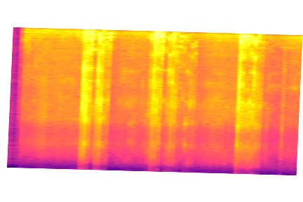
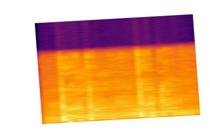
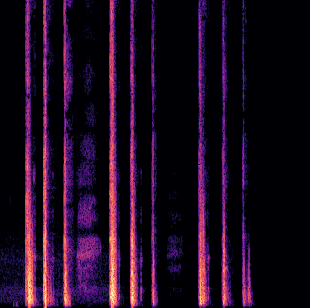
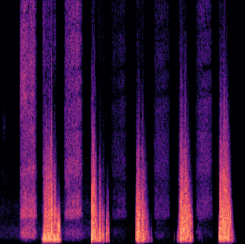

# covid19-cough

This repository contains two datasets of coughs for preliminary diagnosis of COVID-19, and also some notebooks and scripts to play with the data.

## Anaselmasry from kaggle
The first dataset, located at folder *anaselmasry*, contains pictures of spectrograms from this kaggle dataset:
https://www.kaggle.com/anaselmasry/ai-covid19-from-cough-samples
At folder *anaselmasry/source* you'll find the original images from kaggle.
At folder *anaselmasry/preprocessed* you'll find the images preprocessed.
It contains 1934 spectrograms, 330 of them negative for COVID-19, 1604 positive for COVID-19

Examples of source images:

COVID-19 Negative

COVID-19 Positive

## Coswara
The second database, located at folder *coswara*, contains data derivated for the repo located here: https://github.com/iiscleap/Coswara-Data
This repo contains audios from 1486 patients, for each patient it contains an audio for breathing-deep, breathing-shallow, cough-heavy, cough-shallow, counting-fast, counting-normal, vowel-a, vowel-e, vowel-o.
There is also a csv file with information from the patients. Each one has an slug used as identifier, that matchs the info at the csv with the audios and spectrograms of each patient. Also, Coswara project provides some data insights here: https://iiscleap.github.io/coswara-blog/coswara/2020/11/23/visualize_coswara_data_metadata.html
The source repo contains the data in wav format stored in tars. At this repo the audios are in mp3 format to reduce the size. Also, spectrogram images has been calculated for each audio. You will find the mp3 at *coswara/audios* and the spectrograms at *coswara/spectrograms*

The script *wav_to_mp3.py* is the one used to transform the source wavs to mp3.
The script *mp3_to_spectrogram.py* is the one used to transform the mp3 files to images with the spectrogram.
The notebook *Mel Spectrogram.ipynb* can be used to take a look into the audios to understand how to visualize the wave, get the Spectrogram, and get the Mel Spectrogram.

It contains data for 1486 patients, 1186 healthy, 107 positive for COVID-19, 22 recovered, and 171 non positive but with respiratory problems.

Example of spectrograms:

Cough Heavy

Deep Breathing

